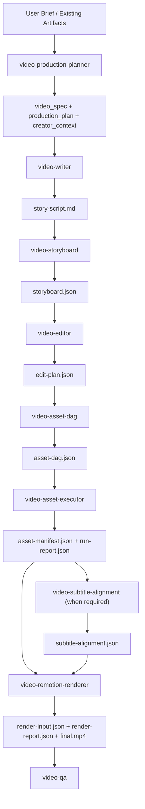

# Video Production Planner README

`video-production-planner` 是这套 AI 视频生产链路的总入口。它负责理解用户目标、选择工作模式、按阶段调度各个 role skill，并用一组固定协议文件把“故事、镜头、执行、字幕、渲染、QA”串成一条可追踪、可恢复、可局部修订的生产流程。

它不是运行时 DAG 引擎，也不是某个具体生成模型的别名。它的职责是做调度、做阶段切换、尊重协议文件里的真相，并在条件满足时把执行工作交给下游角色或 concrete helper。

## 1. 总入口说明

### 1.1 什么时候使用

当用户有下面这类意图时，应优先进入 `video-production-planner`：

- 创建完整视频或短片
- 从 brief 开始生成脚本、分镜、剪辑计划和最终视频
- 基于已有中间产物继续推进后续阶段
- 对已有项目做局部修订并只重跑必要阶段

常见入口表达包括：

- `帮我创建一个视频`
- `生成一个 30 秒 9:16 的 AI 短片`
- `继续这个项目，直接执行素材并渲染`
- `改一下 S_03，然后继续后面的流程`

### 1.2 总入口职责

`video-production-planner` 负责：

- 建立 `video_spec`
- 建立 `production_plan`
- 判断 `workflow_mode`
- 决定是否需要 review gate
- 决定应该加载哪个 role skill
- 根据状态型协议文件判断能否继续下一阶段

`video-production-planner` 不负责：

- 直接写 `story-script.md`
- 直接编译 `storyboard.json`
- 直接执行媒体生成
- 直接对齐字幕
- 直接渲染 `final.mp4`

这些工作必须交由各自的 role skill 完成。

### 1.3 核心调度原则

- Planner 是唯一 dispatcher。Role skill 之间不能互相调用。
- Role skill 只返回自己负责的协议产物，不替其他角色做决定。
- Concrete helper 不替代协议阶段。
- 是否能进入下阶段，不看“感觉应该完成了”，只看协议文件中的真相。

## 2. 总体架构说明

### 2.1 架构分层

整个系统可以分成四层：

| 层级 | 角色 | 说明 |
|---|---|---|
| 入口调度层 | `video-production-planner` | 负责规划、路由、状态判断、review gate 和恢复 |
| 协议生产层 | `video-writer`、`video-storyboard`、`video-editor`、`video-asset-dag` 等 | 负责生成固定协议文件 |
| Concrete execution 层 | `video-asset-executor` + `generate-tts` / `generate-img` / `imgs-to-img` / `generate-video` | 负责真正把任务执行成媒体资产 |
| 消费与校验层 | `video-subtitle-alignment`、`video-remotion-renderer`、`video-qa` | 负责消费执行真相并完成字幕、渲染和验收 |

### 2.2 核心架构图



### 2.3 角色边界

| 角色 | 主要职责 | 不应做的事 |
|---|---|---|
| `video-production-planner` | 调度、规划、状态判断 | 不直接产出其他角色的核心文件 |
| `video-writer` | 产出 `story-script.md` | 不直接生成分镜 JSON |
| `video-storyboard` | 产出 `storyboard.json` | 不直接做执行 DAG |
| `video-editor` | 产出 `edit-plan.json` | 不直接生成素材 |
| `video-asset-dag` | 产出 `asset-dag.json` | 不直接执行媒体生成 |
| `video-asset-executor` | 产出 `asset-manifest.json` 和 `run-report.json` | 不改故事、分镜、剪辑真相 |
| `video-subtitle-alignment` | 产出 `subtitle-alignment.json` | 不猜测不存在的对话时间轴 |
| `video-remotion-renderer` | 产出 `render-input.json`、`render-report.json`、`final.mp4` | 不跳过素材或字幕真相直接渲染 |
| `video-qa` | 产出 `qa_report`、修订建议 | 不越权修改上游核心文件 |

## 2.4 Multi-Agent 协作模式

除了单一 planner 驱动的标准链路外，这套系统也支持一种更强约束的协作方式：

- 1 个主 agent
- 3 个子 agent：
  - 导演
  - 资产生成
  - 剪辑

在这种模式下，主 agent 仍然必须持有 `video-production-planner`，并继续充当唯一 dispatcher。子 agent 之间不直接互相调用，而是由主 agent 统一派单、回收产物、判断 blocker、决定下一阶段。

推荐映射如下：

| Agent | 必选 skills | 可选 skills | 主要产物 |
|---|---|---|---|
| 主 agent | `video-production-planner` | `video-qa`、`video-asset-visualizer` | `production_plan`、调度状态、最终验收 |
| 导演子 agent | `video-writer`、`video-storyboard` | `video-director`、`video-art-director`、`video-sound-designer` | `story-script.md`、可选 `direction-notes.md`、`storyboard.json` |
| 资产生成子 agent | `video-asset-dag`、`video-asset-executor` | `generate-tts`、`generate-img`、`imgs-to-img`、`generate-video` | `asset-dag.json`、`asset-manifest.json`、`run-report.json` |
| 剪辑子 agent | `video-editor` | `video-subtitle-alignment`、`video-remotion-renderer` | `edit-plan.json`、`subtitle-alignment.json`、`render-input.json`、`render-report.json`、`final.mp4` |

推荐协作顺序：

1. 主 agent 用 `video-production-planner` 建立 `production_plan`
2. 导演子 agent 产出 `story-script.md` 与 `storyboard.json`
3. 剪辑子 agent 产出 `edit-plan.json`
4. 资产生成子 agent 产出并执行 `asset-dag.json`
5. 主 agent 判断 `asset-manifest.json + run-report.json` 是否允许继续
6. 剪辑子 agent 在需要时完成字幕对齐与渲染
7. 主 agent 做 QA、验收、修订路由

最重要的文件写权限建议保持唯一归属：

- 导演子 agent：只写 `story-script.md`、`direction-notes.md`、`storyboard.json`
- 资产生成子 agent：只写 `asset-dag.json`、`asset-manifest.json`、`run-report.json`
- 剪辑子 agent：只写 `edit-plan.json`、`subtitle-alignment.json`、`render-input.json`、`render-report.json`、`final.mp4`
- 主 agent：只写 `production_plan`、调度状态、`qa_report`

完整角色矩阵、写权限、revision routing、dispatch 模板见：
[video-multi-agent-orchestrator/SKILL.md](/Users/yangel/Documents/code/magic-skills/video-multi-agent-orchestrator/SKILL.md)
[role-mapping.md](/Users/yangel/Documents/code/magic-skills/video-multi-agent-orchestrator/references/role-mapping.md)

## 3. 工作模式

### 3.1 orchestration_mode

```yaml
orchestration_mode: direct_stage | planner_orchestrated
```

- `direct_stage`
  适用于用户只要单个文件或单个阶段结果。
- `planner_orchestrated`
  适用于完整链路、跨多阶段推进、从中间状态恢复、或需要 planner 持续往后调度的情况。

### 3.2 workflow_mode

```yaml
workflow_mode: narration_only | dialogue_only | mixed
```

| 模式 | 适用场景 | 音频主路径 | 字幕规则 |
|---|---|---|---|
| `narration_only` | 解说、旁白故事、说明型视频 | `remotion_tts` 规划路径；执行时 `voiceover_tts` 通常由 `generate-tts` 落地 | 通常不需要 `subtitle-alignment.json` |
| `dialogue_only` | 剧情对话、角色口播 | `kling_native` 或明确的 dialogue path | 必须先做 `subtitle-alignment.json` |
| `mixed` | 旁白 + 对话混合 | 场景级拆分 | 只有对话场景进入字幕对齐 |

### 3.3 generation_policy

```yaml
generation_policy: specs_only | execute_assets | render_final
```

| 策略 | 含义 |
|---|---|
| `specs_only` | 只产协议，不执行媒体生成，不渲染 |
| `execute_assets` | 产协议并执行媒体素材，但不一定渲染最终成片 |
| `render_final` | 完整跑到渲染阶段，输出 `final.mp4` |

## 4. 固定生产协议

这条链路是 file-first 协议，不允许用自由文本总结替代核心产物。

### 4.1 固定文件链

```text
brief
-> story-script.md
-> storyboard.json
-> edit-plan.json
-> asset-dag.json
-> asset-manifest.json + run-report.json
-> subtitle-alignment.json when required
-> render-input.json + render-report.json + final.mp4
-> qa_report
```

### 4.2 真相文件

| 文件 | 真相含义 |
|---|---|
| `edit-plan.json` | 时间线真相 |
| `asset-manifest.json` | 素材真相 |
| `run-report.json` | 执行真相 |
| `subtitle-alignment.json` | 字幕时间轴真相 |
| `render-report.json` | 渲染真相 |

Planner 必须根据这些真相文件判断是否可继续，而不是根据“某个文件存在”就默认成功。

## 5. 全流程说明

标准全链路如下：

1. 读取 brief、现有中间产物和 creator memory。
2. 生成 `video_spec` 和 `production_plan`。
3. 调用 `video-writer` 产出 `story-script.md`。
4. 调用 `video-storyboard` 产出 `storyboard.json`。
5. 调用 `video-editor` 产出 `edit-plan.json`。
6. 调用 `video-asset-dag` 产出 `asset-dag.json`。
7. 若需要执行媒体生成，调用 `video-asset-executor` 产出 `asset-manifest.json` 和 `run-report.json`。
8. 若存在 native dialogue 场景，调用 `video-subtitle-alignment` 产出 `subtitle-alignment.json`。
9. 当素材真相和字幕真相满足条件时，调用 `video-remotion-renderer` 产出 `render-input.json`、`render-report.json`、`final.mp4`。
10. 最后调用 `video-qa` 做验收和修订路由。

## 6. Concrete Helper 集成

Concrete helper 是执行层工具，不是新的协议阶段。

### 6.1 当前集成关系

| 执行任务 | 默认 concrete helper | 说明 |
|---|---|---|
| `voiceover_tts` | `generate-tts` | 用于旁白 TTS 的同步落地 |
| `character_reference` | `generate-img` | 角色参考图 |
| `keyframe_image` with reusable character / key-prop refs | `imgs-to-img` | 把角色或关键道具参考图明确合成进关键帧 |
| `keyframe_image` without those refs | `generate-img` | 普通场景关键帧 |
| `image_to_video` | `generate-video` | 图片转视频 |
| `native_dialogue_video` | `generate-video` | 原生对话视频 |

### 6.2 一条重要原则

- Planner 不直接调用 `generate-tts` / `generate-img` / `imgs-to-img` / `generate-video`。
- Planner 只把执行权交给 `video-asset-executor`。
- `video-asset-executor` 再根据 `asset-dag.json` 中的任务声明决定是否调用 concrete helper。

## 7. 输入输出契约表

### 7.1 总入口输入输出

| 对象 | 类型 | 说明 |
|---|---|---|
| 输入 | `brief` / 现有协议文件 / creator memory | Planner 的上游上下文 |
| 输出 | `video_spec` | 项目规格与工作模式 |
| 输出 | `production_plan` | 阶段计划、review gate、依赖与目标产物 |
| 输出 | `creator_context` | 可选的创作者偏好与历史上下文 |

### 7.2 核心协议文件契约

涉及资产执行链路时，推荐把 [gold-asset-dag.json](/Users/yangel/Documents/code/magic-skills/video-production-planner/references/gold-asset-dag.json)、[gold-asset-manifest.json](/Users/yangel/Documents/code/magic-skills/video-production-planner/references/gold-asset-manifest.json)、[gold-run-report.json](/Users/yangel/Documents/code/magic-skills/video-production-planner/references/gold-run-report.json) 作为成对样例一起参考，重点看 `expected_outputs`、`assets[].id`、`tasks[].output_asset_ids` 三者如何一一对应。

| 文件 | 生产者 | 主要输入 | 主要输出内容 | 下游消费者 |
|---|---|---|---|---|
| `story-script.md` | `video-writer` | `brief`、`video_spec`、`creator_context` | 分场故事脚本、`visual`、台词/旁白、`SFX`、连续性锚点 | `video-storyboard` |
| `storyboard.json` | `video-storyboard` | `story-script.md` | 场景结构、资产注册、音频意图、`image_prompt`、`video_prompt` | `video-editor`、审美/声音 review |
| `edit-plan.json` | `video-editor` | `storyboard.json` | 时间线、source strategy、motion、audio strategy、subtitle strategy | `video-asset-dag`、`video-remotion-renderer` |
| `asset-dag.json` | `video-asset-dag` | `storyboard.json`、`edit-plan.json` | 执行任务、依赖关系、tool assignment、expected outputs | `video-asset-executor` |
| `asset-manifest.json` | `video-asset-executor` | `asset-dag.json`、已生成或已提供素材 | 远程媒体 URL、素材类型，以及必要时的补充元数据 | `video-subtitle-alignment`、`video-remotion-renderer`、`video-qa` |
| `run-report.json` | `video-asset-executor` | `asset-dag.json`、执行结果 | task status、blocked reason、retry state | Planner、`video-qa` |
| `subtitle-alignment.json` | `video-subtitle-alignment` | `edit-plan.json`、`asset-manifest.json` | 对话字幕 cue、对齐状态、blocked scene | `video-remotion-renderer`、`video-qa` |
| `render-input.json` | `video-remotion-renderer` | `edit-plan.json`、`asset-manifest.json`、可选 `subtitle-alignment.json` | 渲染输入时间线、资产引用、字幕引用、音频混音 | 渲染器自身、调试 |
| `render-report.json` | `video-remotion-renderer` | 渲染执行结果 | 成功/阻塞/失败状态、输出信息、blockers | Planner、`video-qa` |
| `final.mp4` | `video-remotion-renderer` | `render-input.json` | 最终视频文件 | 用户、`video-qa` |
| `qa_report` | `video-qa` | 全部已产协议文件与执行状态 | 通过情况、blocker、revision_tasks | Planner、用户 |

### 7.3 各文件最关键的契约点

| 文件 | 关键约束 |
|---|---|
| `story-script.md` | 必须使用增强版脚本格式，不兼容 legacy minimal script |
| `storyboard.json` | 必须是合法 JSON；`image_prompt` 是单一静态画面，`video_prompt` 是对应动态延续 |
| `edit-plan.json` | 是渲染时间线真相，不是建议稿 |
| `asset-dag.json` | 只定义执行任务，不直接执行工具 |
| `asset-manifest.json` | 必须完整列出本次执行产生的图片、音频、视频等资产；默认应以远程 `url` 作为主字段，而不是只写本地 `path`；资产 key 应使用 `expected_outputs` 中的最终资产 ID，如 `VID_S01`，而不是 `T_VID_S01` |
| `run-report.json` | 必须显式区分 `success`、`partial`、`blocked`、`failed` |
| `subtitle-alignment.json` | 不能根据脚本文字长度猜字幕时间 |
| `render-report.json` | 必须显式声明 blocker，不能靠文件存在默认渲染成功 |

## 8. 阶段依赖与阻塞规则

### 8.1 必要依赖

| 目标阶段 | 必要输入 |
|---|---|
| `storyboard.json` | `story-script.md` |
| `edit-plan.json` | `storyboard.json` |
| `asset-dag.json` | `storyboard.json` + `edit-plan.json` |
| `asset-manifest.json` / `run-report.json` | `asset-dag.json` |
| `subtitle-alignment.json` | `edit-plan.json` + `asset-manifest.json` |
| `render-input.json` | `edit-plan.json` + `asset-manifest.json` |
| `final.mp4` | `render-input.json` + `render-report.json` |

### 8.2 继续推进前必须检查的状态

- 若 `run-report.json.status = blocked`，默认不能继续渲染。
- 若需要字幕对齐但 `subtitle-alignment.json.status = blocked`，默认不能继续渲染。
- 若 `asset-manifest.json` 缺少 render-critical scene assets，默认不能继续渲染。
- 若用户只要求 `specs_only`，后续执行、字幕、渲染阶段应全部标记为 `not_requested`。

## 9. 常见调用路径

| 用户目标 | 最小链路 |
|---|---|
| 只写脚本 | `video-writer` |
| 从 brief 生成分镜 | `video-writer` -> `video-storyboard` |
| 从分镜生成剪辑计划 | `video-editor` |
| 从 DAG 执行素材 | `video-asset-executor` |
| 对齐原生对话字幕 | `video-subtitle-alignment` |
| 从素材和时间线渲染成片 | `video-remotion-renderer` |
| 做完整视频生产 | `video-production-planner` |

## 10. 推荐入口示例

### 10.1 完整链路

```text
Use video-production-planner. Make a 45 second 9:16 AI short about a repair robot hearing the last radio broadcast from an underwater city. Continue through script, storyboard, edit plan, asset DAG, asset execution, subtitle alignment when needed, render, and QA.
```

### 10.2 只产协议

```text
Use video-production-planner. Create a 30 second narration-only short. Specs only. Do not generate images, audio, video, subtitles, or render.
```

### 10.3 从中间状态继续

```text
Use video-production-planner. Continue this project from existing storyboard.json and edit-plan.json. Execute assets when tools are available, then render if the execution truth is sufficient.
```

## 11. 参考文件

- `SKILL.md`
- `references/claw-production-protocol.md`
- `references/artifact-contracts.md`
- `references/capabilities.md`
- `references/workflow-variants.md`
- `references/memory-policy.md`
- `references/test-cases.md`

如果要理解这条链路，推荐按这个顺序阅读：

1. 先读 `SKILL.md`，理解 planner 的边界和 full flow。
2. 再读 `references/claw-production-protocol.md`，理解固定协议文件链。
3. 再读 `references/artifact-contracts.md`，理解每个文件的输入输出形状。
4. 最后读 `references/workflow-variants.md` 和 `references/test-cases.md`，理解变体流程和边界案例。
